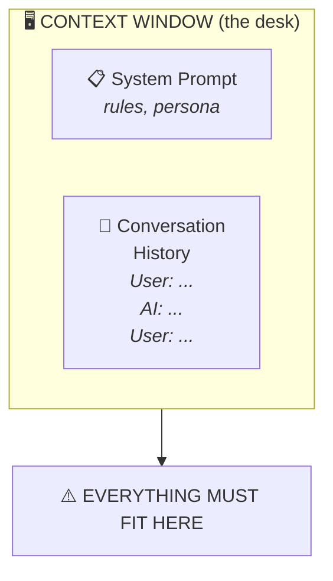

## The Reveal: Working Memory

**The context window is the AI's "desk" - everything must fit on it.**

**Window sizes** (current, 2026):
- GPT-4o: ~128K tokens (~300 pages of text)
- Claude Opus 4.6: ~1M tokens (~2,000 pages)
- Gemini: up to 2M tokens (but quality degrades)