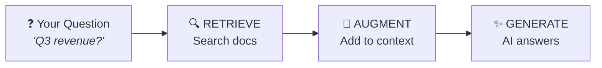
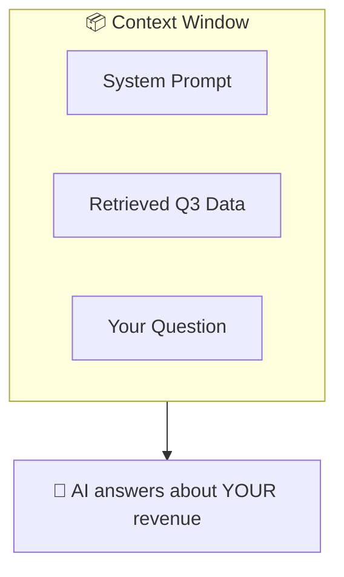

### RAG: "Let me look that up"

**RAG = Retrieval-Augmented Generation**

```mermaid
flowchart LR
    Q["❓ Your Question<br/><i>'Q3 revenue?'</i>"]
    R["🔍 RETRIEVE<br/>Search docs"]
    A["📎 AUGMENT<br/>Add to context"]
    G["✨ GENERATE<br/>AI answers"]

    Q --> R --> A --> G
```

```mermaid
flowchart TB
    subgraph CW["📦 Context Window"]
        S["System Prompt"]
        D["Retrieved Q3 Data"]
        U["Your Question"]
    end
    CW --> O["💬 AI answers about YOUR revenue"]
```

**RAG = external memory.** Brings in information at query time.