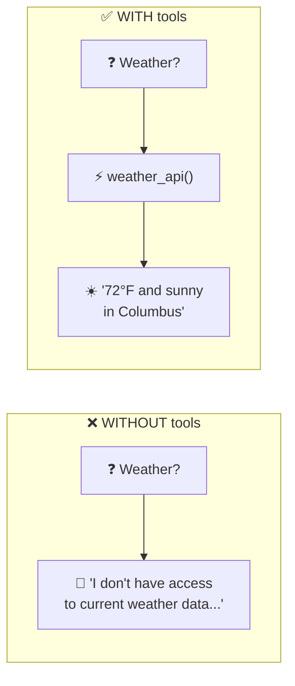

## The Shift: From Talking to Doing

**Old AI:** Input text → Output text

**Modern AI:** Input text → DECIDE to use tools → Output text + actions

```mermaid
flowchart LR
    subgraph WITHOUT["❌ WITHOUT tools"]
        Q1["❓ Weather?"]
        A1["🤷 'I don't have access<br/>to current weather data...'"]
        Q1 --> A1
    end

    subgraph WITH["✅ WITH tools"]
        Q2["❓ Weather?"]
        T["⚡ weather_api()"]
        A2["☀️ '72°F and sunny<br/>in Columbus'"]
        Q2 --> T --> A2
    end
```