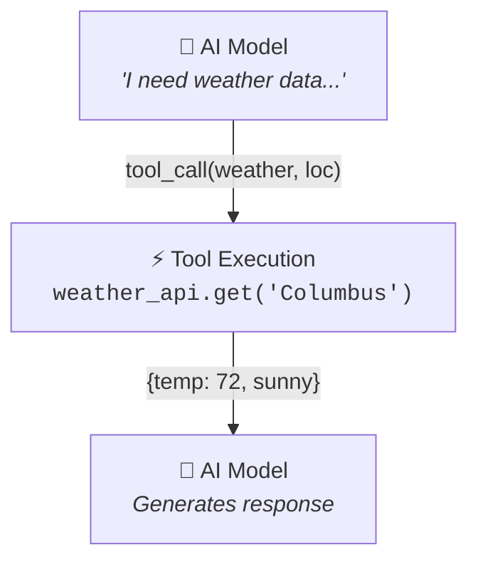

## How Tool Use Works

```mermaid
flowchart TD
    A["🤖 AI Model<br/><i>'I need weather data...'</i>"]
    B["⚡ Tool Execution<br/><code>weather_api.get('Columbus')</code>"]
    C["🤖 AI Model<br/><i>Generates response</i>"]

    A -->|"tool_call(weather, loc)"| B
    B -->|"{temp: 72, sunny}"| C
```

**The AI doesn't execute tools** - it asks to use them, something else executes, result comes back.