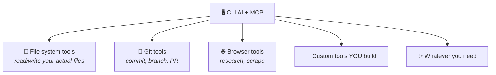

## Why MCP Matters to You

### For Browser Users
- ChatGPT plugins, Gemini extensions = early tool ecosystems
- Limited to what the platform offers

### For CLI Users (where we're going)
- YOU decide what tools are available
- Connect to your systems: files, databases, APIs
- The harness manages tool access

