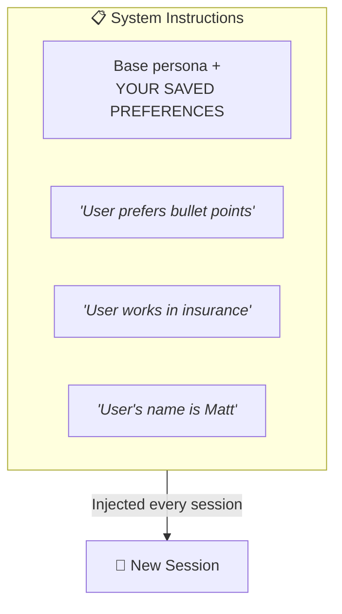

## How "Memory" Actually Works

### Browser AI Memory (ChatGPT, Gemini)

**It's just text** prepended to every conversation.

**Managed by:**
- The platform (ChatGPT Memory settings)
- You explicitly ("Remember that I...")
- AI inferring and saving