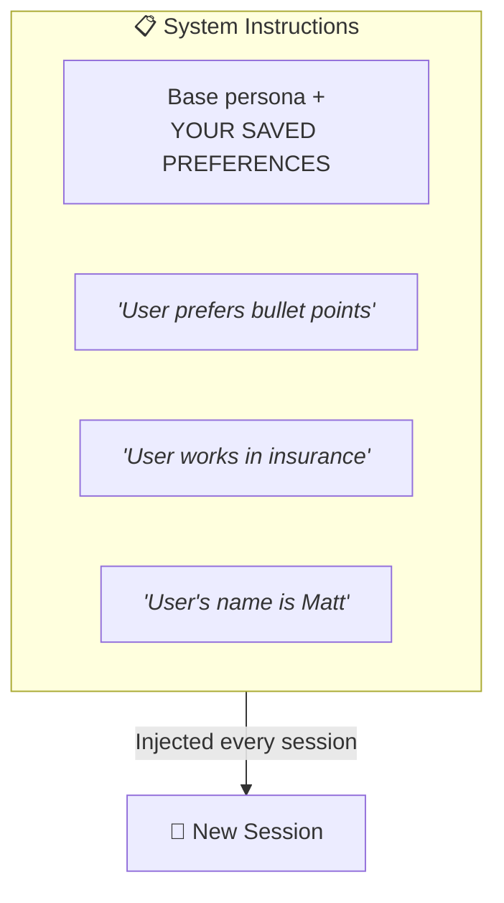

## How "Memory" Actually Works

### Browser AI Memory (ChatGPT, Gemini)



**It's just text** prepended to every conversation.

```
Memory ≠ Remembering
Memory = Reading your preferences from storage every time
```

**Implications:**
- Memory competes with context window space — the more "memory," the less room for conversation
- You can (and should) edit/curate what's stored
- **Projects / Gems / Custom Instructions** are the same mechanism, just scoped to one workspace instead of everywhere
