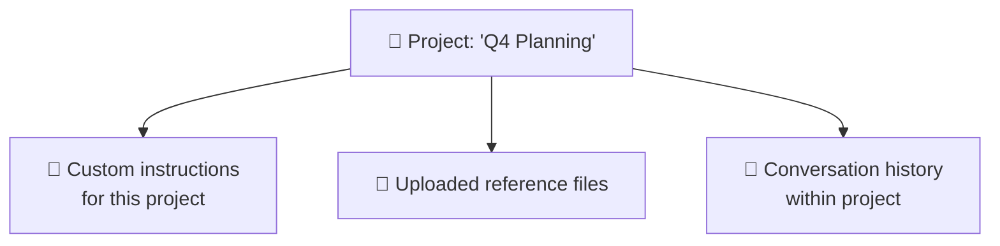

## Projects & Custom Instructions

**ChatGPT Projects / Gemini Gems / Claude Projects:**

Same concept, scoped differently:
- **Personal memory**: applies everywhere
- **Project context**: applies to specific work

