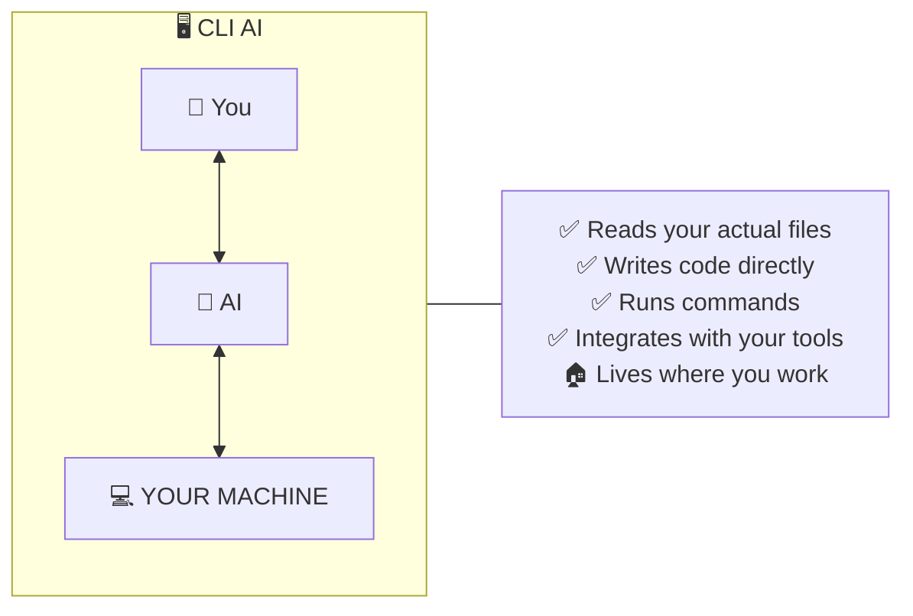

### CLI: AI in Your Workspace

```mermaid
flowchart LR
    subgraph CLI["🖥️ CLI AI"]
        direction TB
        Y["👤 You"]
        A["🤖 AI"]
        M["💻 YOUR MACHINE"]
        Y <--> A <--> M
    end
    L["✅ Reads your actual files<br/>✅ Writes code directly<br/>✅ Runs commands<br/>✅ Integrates with your tools<br/>🏠 Lives where you work"]
    CLI --- L
```

**It works WITH you.** In your actual workspace.