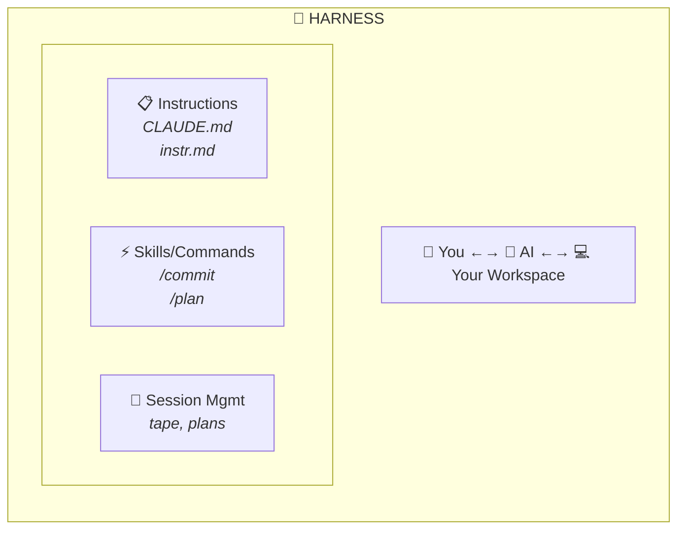

## What Is a Harness?

> "A harness is a structured environment that wraps your AI CLI with conventions, workflows, and automation."

```mermaid
flowchart TB
    subgraph H["🔧 HARNESS"]
        direction TB
        subgraph PARTS[" "]
            direction LR
            I["📋 Instructions<br/><i>CLAUDE.md<br/>instr.md</i>"]
            S["⚡ Skills/Commands<br/><i>/commit<br/>/plan</i>"]
            M["📝 Session Mgmt<br/><i>tape, plans</i>"]
        end
        FLOW["👤 You ←→ 🤖 AI ←→ 💻 Your Workspace"]
    end
```