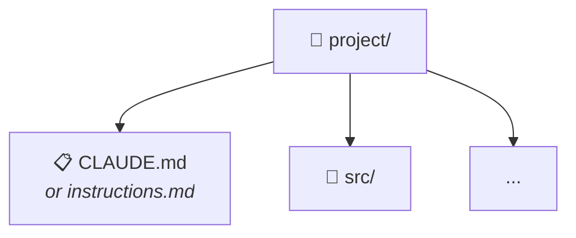

### 2. Project Instructions
**Context for specific work**

```mermaid
flowchart TB
    P["📁 project/"]
    C["📋 CLAUDE.md<br/><i>or instructions.md</i>"]
    S["📂 src/"]
    E["..."]

    P --> C
    P --> S
    P --> E
```

Contains:
- What this project is
- Architecture decisions
- Current state
- Things to avoid