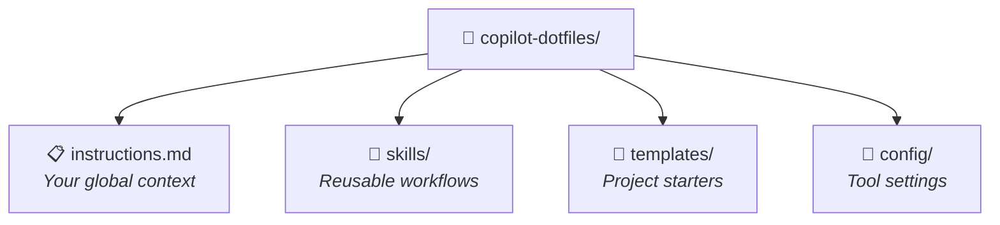

## The copilot-dotfiles Harness

What you'll install in Part 3:

```mermaid
flowchart TB
    ROOT["📁 copilot-dotfiles/"]
    I["📋 instructions.md<br/><i>Your global context</i>"]
    SK["📂 skills/<br/><i>Reusable workflows</i>"]
    T["📂 templates/<br/><i>Project starters</i>"]
    C["📂 config/<br/><i>Tool settings</i>"]

    ROOT --> I
    ROOT --> SK
    ROOT --> T
    ROOT --> C
```

**It's a starting point** - you customize and extend for your needs.