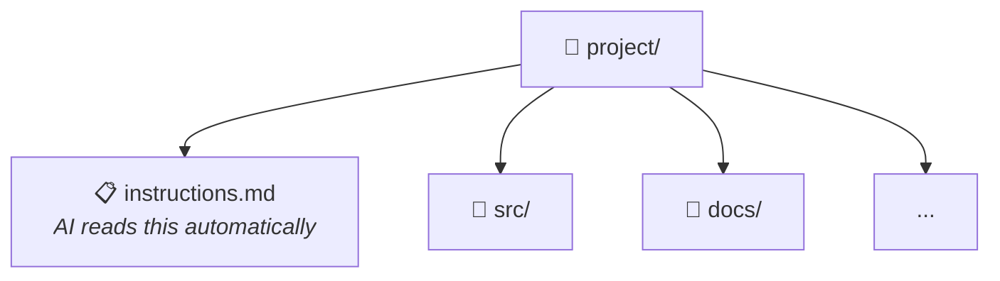

### The Better Approach: Automatic Context Loading

CLI tools like Copilot and Claude Code look for instruction files:
- `instructions.md` (Copilot)
- `CLAUDE.md` (Claude Code)
- `.github/copilot-instructions.md`

**Every session in this folder automatically gets the context.**