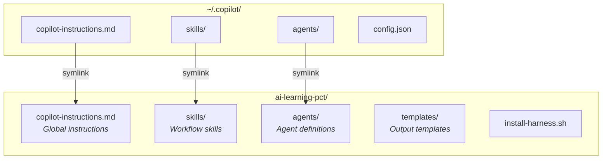

## What Got Installed

```mermaid
flowchart TB
    subgraph COPILOT["~/.copilot/"]
        CI["copilot-instructions.md"]
        SK2["skills/"]
        AG2["agents/"]
        CF["config.json"]
    end
    CI -->|"symlink"| CI2
    SK2 -->|"symlink"| SK
    AG2 -->|"symlink"| AG

    subgraph REPO["ai-learning-pct/"]
        CI2["copilot-instructions.md<br/><i>Global instructions</i>"]
        SK["skills/<br/><i>Workflow skills</i>"]
        AG["agents/<br/><i>Agent definitions</i>"]
        T["templates/<br/><i>Output templates</i>"]
        INS["install-harness.sh"]
    end
```