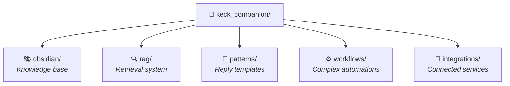

## Demo Script

### 1. The Big Picture (30 seconds)

> "What you built today is the starting point. Here's where it can go after months of iteration."

Show the directory structure briefly:

```mermaid
flowchart TB
    ROOT["📁 keck_companion/"]
    O["📚 obsidian/<br/><i>Knowledge base</i>"]
    R["🔍 rag/<br/><i>Retrieval system</i>"]
    P["📝 patterns/<br/><i>Reply templates</i>"]
    W["⚙️ workflows/<br/><i>Complex automations</i>"]
    I["🔗 integrations/<br/><i>Connected services</i>"]

    ROOT --> O
    ROOT --> R
    ROOT --> P
    ROOT --> W
    ROOT --> I
```